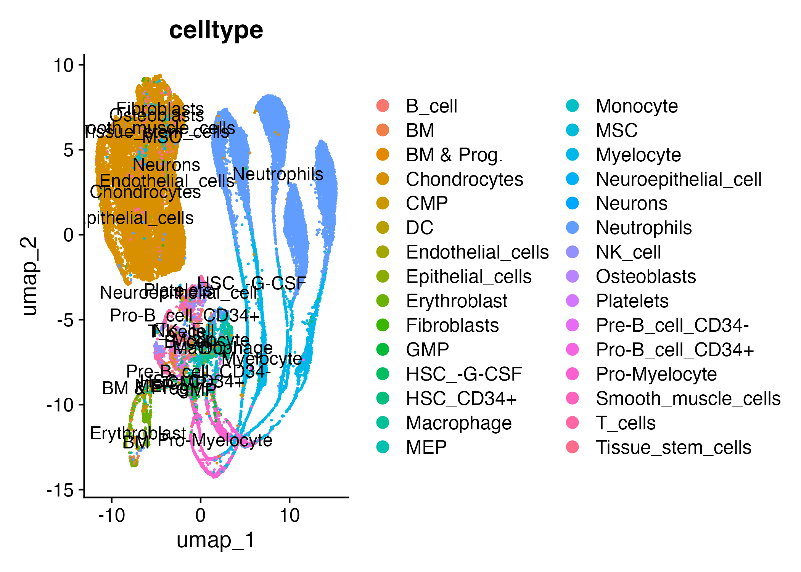
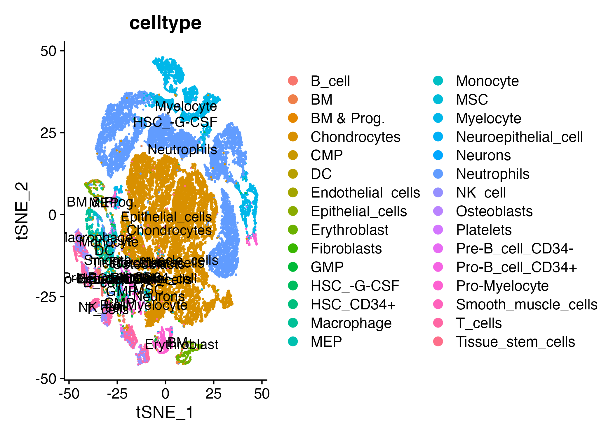

## 📘 Experimental Design Summary

This analysis is based on the single-cell RNA-seq dataset published in:

> Tu, J. et al. (2021). Single-Cell Transcriptomics of Human Nucleus Pulposus Cells: Understanding Cell Heterogeneity and Degeneration. *Advanced Science*, 8(23), 2103631. https://doi.org/10.1002/advs.202103631

### Study Objectives:
- Profile transcriptional heterogeneity in human nucleus pulposus cells (NPCs).
- Compare non-degenerated (Grade II) and degenerated (Grade III–IV) intervertebral discs.
- Identify distinct NPC subtypes and reconstruct cellular trajectories.

### Data Source:
- GEO accession: [GSE165722](https://www.ncbi.nlm.nih.gov/geo/query/acc.cgi?acc=GSE165722)
- Technology: BD Rhapsody platform
- Samples: 8 NPC tissue samples with varying degeneration states.

### Summary of Analysis Flow:
1. **QC and Filtering**: Remove low-quality cells with high mitochondrial content.
2. **Normalization and Clustering**: Use Seurat to identify transcriptionally distinct clusters.
3. **Marker Gene Detection**: Find genes distinguishing each cluster.
4. **Cluster Annotation**: Label clusters into known biological subtypes.
5. **Pseudotime Analysis**: Use Monocle3 to infer differentiation trajectories.

### Interpretation:
From the plots generated:
- **UMAP/tSNE**: Reveal 6 biologically interpretable NPC subtypes.
- **DotPlot**: Confirms canonical marker expression in annotated subtypes.
- **Pseudotime**: Suggests HT-CLNPs are early progenitors transitioning into mature states such as effector or fibroNPCs.

---
title: "SingleCellDesk Example Analysis"
output: html_document
---

```{r setup, include=FALSE, eval=FALSE}
```

## 📥 Choose Dataset Format

This analysis use dataset "GSE165722".

```{r choose-loader, eval=FALSE}
```

## 🔬 Step 1: Quality Control

```{r step1-qc, eval=FALSE}
```

### QC Violin Plot

```{r, echo=FALSE, fig.cap='QC Violin Plot'}
knitr::include_graphics("results/plots/qc_vlnplot.png")
```

## 🔬 Step 2: Normalization and Clustering

```{r step2-cluster, eval=FALSE}
```

### UMAP Clustering (Default)

```{r, echo=FALSE, fig.cap='UMAP Clusters'}

```
### t-SNE Clustering with Cell Types

```{r, echo=FALSE, fig.cap='tSNE Clusters by Cell Type'}

```

## 🔬 Step 3: Marker Identification and Annotation

```{r step3-annotation, eval=FALSE}
```

### Marker Genes (Preview)

```{r, echo=FALSE}
head(read.csv("results/tables/marker_genes_all_clusters.csv"))
```

### DotPlot of Top Markers

```{r, echo=FALSE, fig.cap='Top Marker DotPlot'}
knitr::include_graphics("results/plots/dotplot_top_markers.png")
```
### Barplot: Cell Type Distribution

```{r, echo=FALSE, fig.cap='Cell Type Distribution Barplot'}
knitr::include_graphics("results/plots/barplot_celltype_distribution.png")
```

## 🔬 Step 4: Pseudotime Inference with Monocle3

```{r step4-pseudotime, eval=FALSE}
```

### Pseudottime Trajectory

```{r, echo=FALSE, fig.cap='Pseudotime trajectory of NPC populations'}
knitr::include_graphics("results/plots/pseudotime_plot.png")
```

## 🔬 Step 5: Cell-Cell Communication with CellChat

```{r step5-cellchat, eval=FALSE}
```

## 📌 Notes

- For GSE165722, the `.counts.tsv.gz` and `.cellname.txt.gz` pairs are expected in `data/GSE165722/extracted/`
- For 10x, use individual `filtered_feature_bc_matrix/` directories for each sample.
## 📊 Additional Static Results


